# MC 服务器后端大佬

### 先给大佬打个广告

专业搭建米米世界服务器、米米世界面板、ddos 集群服务器等，需要请联系大佬

大佬拥有多项技能这里简单介绍一些专业的

### 网络资源爬虫

大佬表示自己专业的欠缺

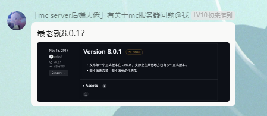

### 大佬运行 Node.js 程序

大佬吐槽 Windows 终端存在使用体验上的问题

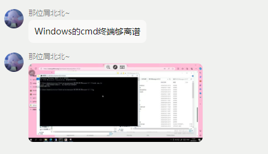

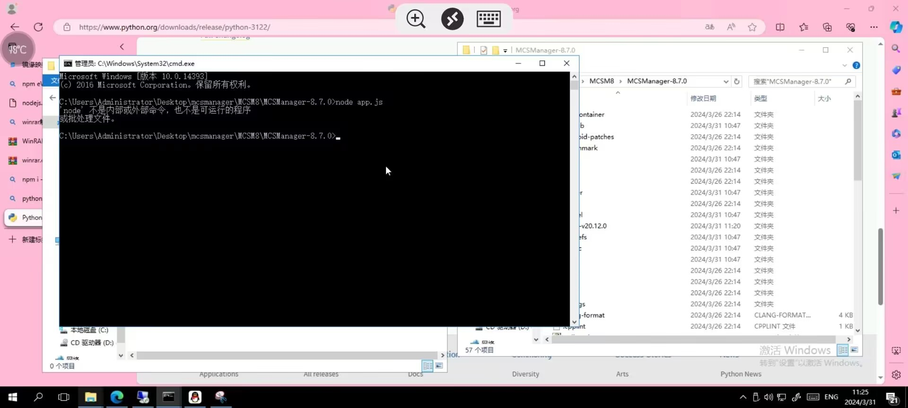

### 大佬认为 Windows 环境变量配置过程过于繁琐，影响使用体验

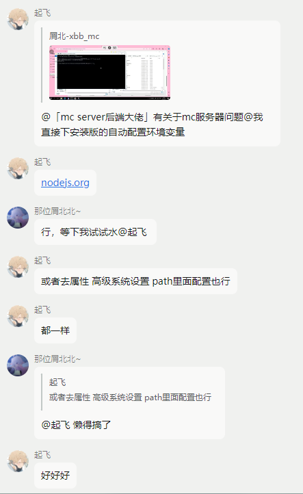

### 大佬在运行程序时遇到问题

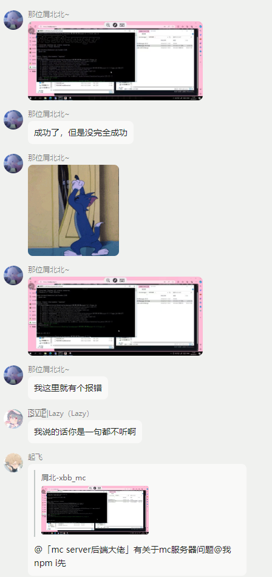

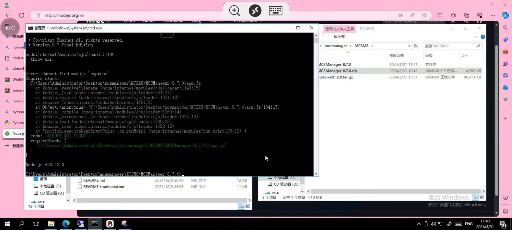

### 大佬表示不忍直视

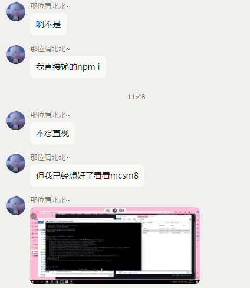

### 大佬表示服务器延迟过高

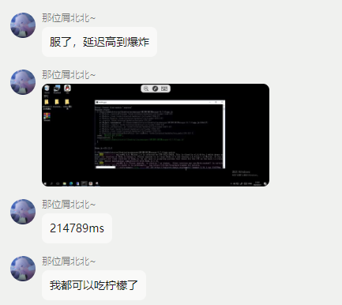

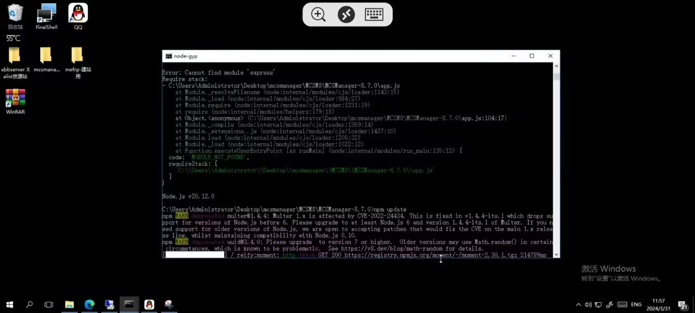

### 大佬成功爬取并完成部署响应的程序

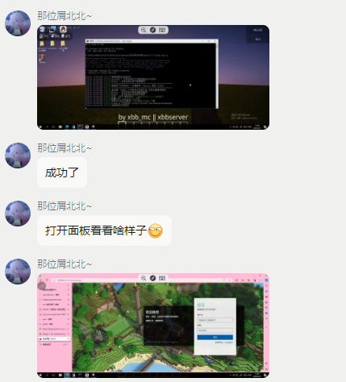

### 大佬表示程序过于劣质，完全不如自己的冰山一角

### 大佬吐槽别人写的代码

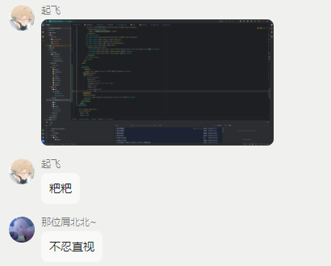

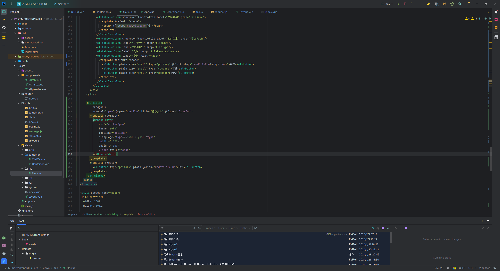

### 大佬证明自己的技能

大佬发布自己制作的资源共享站点和整合包

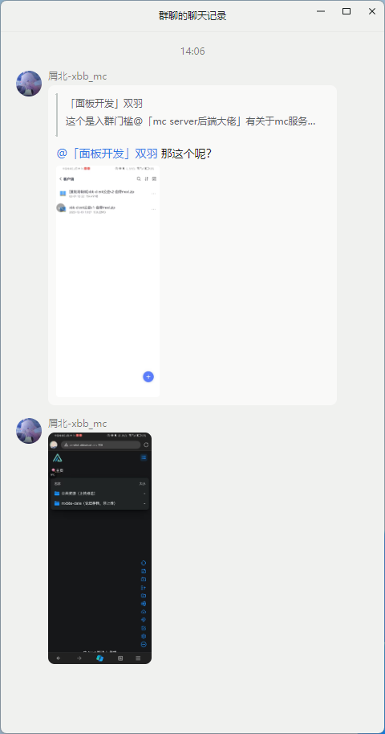

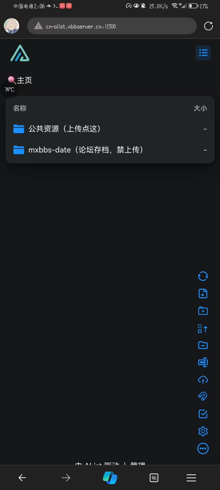

大佬证明自己的实力

### 大佬公布往期成果

### 大佬对程序发表的看法

### 大佬分享自己的开服心路历程

### 大佬分享自己的系统使用技巧

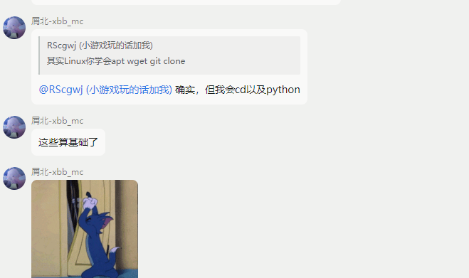

### 大佬分享自己的 “BGP” 线路服务器

（经查询大佬的 cdn 一大堆的服务器）

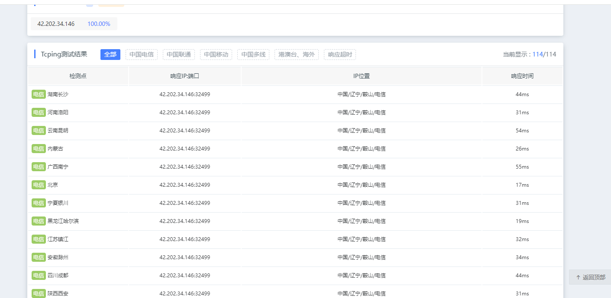

大佬对未使用 cdn 发表重要讲话

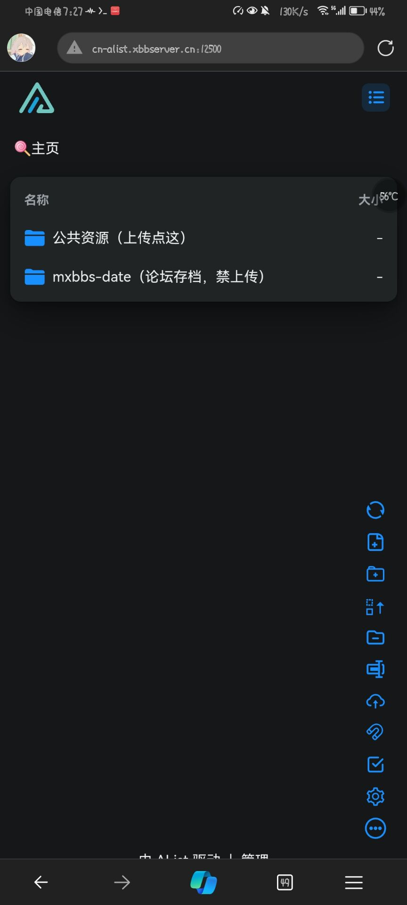

### 大佬表示使用 Termiux 可以实现远程服务器终端

### 大佬对中华人民共和国工业和信息化部的备案规定发表解释

### 大佬表示需要窃取 php 用于开服

### 大佬表示自己开服成功

### 大佬争论 Microsoft Edge 与 Google Chromium 无关

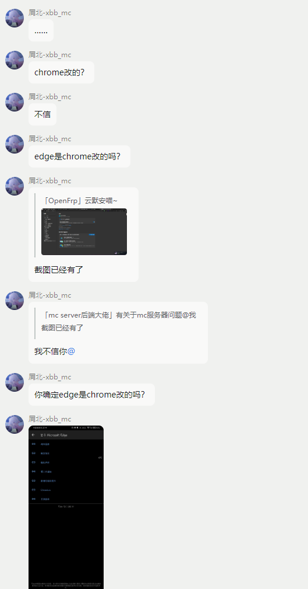

### 大佬急需 Microsoft Edge 是 Chromium 内核的证据

### 大佬表示需要伤感

### 大佬对阿里云国内免备案服务器上的 Alis 发表看法

### 大佬表示天天发送截图中的机器是临时的机器

### 大佬表示学校的机器带宽更高

### 大佬对 20Mbps 带宽机器搭建 alist 发表重要看法

### 大佬表示 Onedrive 上传过慢是因为服务器的带宽过低

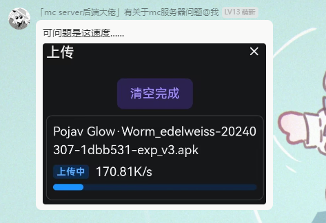

（怎么今天大佬讲话突然没有那股严厉的味道了）

### 大佬表示不可忍受

### 大佬表示妥协

### 大佬表示但是没有完全妥协

### 大佬表示没一个行的

### 大佬再次表示 Onedrive 速度不佳

### 大佬发表完对 Onedrive 的评价后，对 Onedrive 提出相关问题

### 大佬表示因为报错所以非常生气

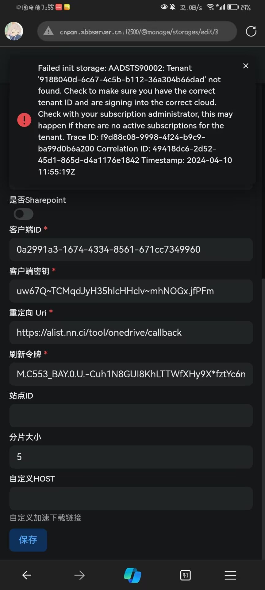

（啊？这是复制粘贴都不带修改的？）

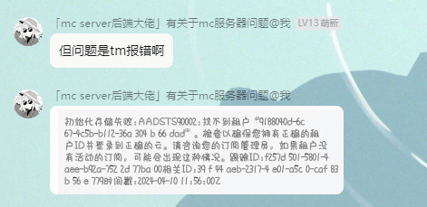

### 大佬表示自暴自弃

