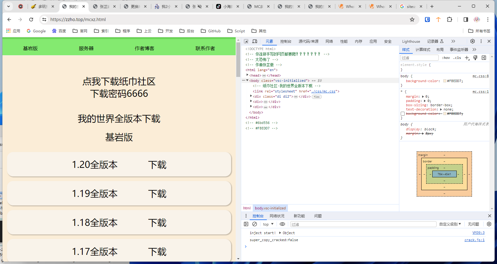
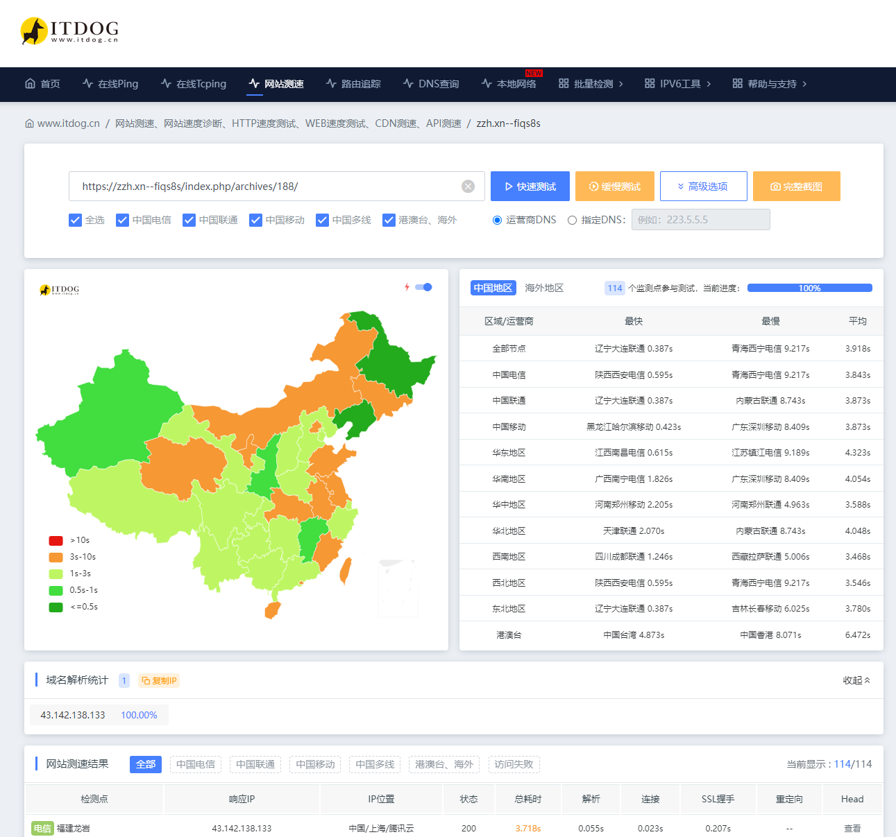

# 多玩我的世界盒子员工

互联网上很多 “黑客追回骗子骗来的财产” 、“黑客删除骗子站点数据库” 、“黑客帮助朋友解决裸聊勒索” 等等 “高级” 视频，但是这些视频，100% 都是演的。世界上根本不存在黑客，中国内地的营销号多了，轻信营销号言论的人，也就成了黑客。然而他们只不过是一群热爱计算机的人霸了。本篇文章（文档）将讲述真实的 “黑客” 翻案的经过，大家都是人，都是朴素的。没有营销号口中的那么神

最近群里面有个群友 （QQ 2283377850 ，是小号，本文统称 “群友”），在注册 “多玩我的世界盒子” 的商标，打算 “复刻” ，但是我认为，这是一种不好的行为

于 2024.1.31 晚，这位群友再次在 QQ 聊群中炫耀自己从 “前多玩我的世界盒子员工” 中获取到的代码

如图所示

该群友在聊群中发布疑似关于多玩我的世界盒子复刻的图片，并声称自己要 “搞点大动静”

本人曾多次劝阻这名群友，不要制造盗版产品，更何况这已经不仅仅是抄袭。用别人的名字开发盗版对标软件，还申请商标，无疑是对产品最大的笔试。对此这名群友回复（如图）

紧接回复后，群友发出了关于吐槽 “原多玩我的世界盒子” 源码目录的截图

根据前后群友所发布的截图，这是一个纯原生的 web 源码，并且一眼既可判断为是初学者开发

此后，群友多次证明这套源码正式 “前多玩我的世界盒子” 员工发布给他的，还挂上了该名 “员工” 的 QQ 主页（图片中的马赛克为发送者所为）

根据图片，这名 “员工” 热爱 Beyond，QQ 账号等级中等，个性签名不符合成年人思维

至此，本人看出其中蹊跷，经过与群友确认后，代码并非群友自己对着效果图开发，而是由所谓的 “员工” 提供。于是，本人打算开始碰碰运气

在一开始发送的装逼截图中，本人注意到了项目工程所在文件夹的名字

这个名字看上去像是一个已经上线或者即将上线的网站，直接访问，发现可成功访问，且与一开始的 “装逼截图” 中的预览窗口内容一致，如图所示

这看上去做的确实很像，让我不禁大脑一空：难道这东西是套壳网页？

但是仔细想着软件的使用体验，不是。绝对不是。根据以往的使用，这绝对不是。

当我打开控制台的一瞬间……我只想说，6

首先使用体验不是一般的差，关是速度，这样简单的网页，在本人使用 IEPL 国际专线且是目标服务器所在地落地的情况下都需要加载如此之久（附上 itdog 测速的截图）

页面的所有内容都是写死的先不说（如下图1），我从未见过如此高级的跳转方法（如下图2），而且样式。。。。。。还有 url。。。。（如下图3）

总结后，这是初学者复刻的网页。本以上挺好的，没什么问题。但是这怎么就成了用来装逼的资本呢？

本着探究的心态，本人点击了 “启动游戏” 按钮，发现跳转到了一个更为逆天的网页

跳转到了一个新的域名，网站中的内容为 “纸巾社区” ，期初截图中群友给 “员工” 的备注为纸张

点击下载按钮，他居然。。。给每个版本都做了个页面。。。我哭死。

早起的版本下载链接是蓝奏云，后面的版本下载链接是 123 云盘。根据下载到的文件，发现该下载站的资源是搬运的 李子豪（zihao_il） 的。点击上方导航栏的 “服务器”

发现是服务器广告。这背景图，满满的多玩味。而且比例也是。。。。

顺带吐槽一下，这开发者耐心地给每一个页面都添加上了这三行注释

这是怕自己的高级页面被别人偷吗？

还有这个路径名。。。

点击导航栏上的 “作者博客” ，跳转到了同站下的 /index.php

是一个 Typecho 程序，也是站长的个人博客。看到这个建站路径，本人不由得怀疑这不会是虚拟主机吧？

看完了所有文章，并未找到有价值的，不过他的第一篇文章，留下了一个新的域名

访问这个域名，发现是另外一个 Typecho 程序，这里的站长看上去成熟许多，网站的优化也有增强，文章的内容也稍微好了一点

阅读关于页面和网站显眼处，并未找到关于作者的其他信息

访问原来的域名的首页，发现了另外一个逆天的内容

经过核查，友情链接中的网站应该不是这个所谓的 “员工” 自己运营的，其他内容就是跳转到之前的网页

查询域名的 whois 信息，后两个域名都比较有价值，直接公开了一个叫做 “罗雁” 的注册人

后根据 中华人民共和国工业和信息化部政务服务平台 ICP 域名备案管理系统查询，域名的备案登记人为 “罗雁”

经过备案号反查也仅查询到一个，本人目测这应该是所谓 “员工” 的家长。当然，至此，这名 “原多玩我的世界盒子” 员工的身份已经被彻底推翻

那 QQ 就找不到了吗？找不到怎么石锤？

本人尝试查找其在博客中的 gravatar 头像，视图找出登记邮箱，虽然这也有一定几率是哈希值

查找后，这尽然不是 gravatar 的头像，是一张本地图片（如图）

图片的名字正是 `qqtx.jpg` （QQ 头像）

这样一来不就彻底石锤了吗，群友口中的 “员工” 正是这名初学者

本人又抱着最后尝试一下的心态，使用博客的搜索系统搜索了 “QQ” 这一关键词

还真找到了

是一篇关于 “员工” 制作的摄影网站的文章，文章中 “员工” 留下了自己的 QQ

同时在演示地址中，找到了这名 “员工” 留下的抖音

后在控制台中发现原来 b 站链接也是有效的，只是被其他元素挡住了。同时找到这名 “员工” 的 b 站账号

在这名 “员工” 的 b 站首页上，再次印证了这个盗版网站的开发者正是其本人，且在简介中留下的 qq 账号也与前面博客文章中的相符

先不管他他的视频，搜索他的 QQ 账号

确实查找到了此人，头像与等级、签名、归属地 等资料全部吻合

因 QQ 提示存在 2 个共同的聊群

后经查找，发现本人与该 “员工” 同在多玩我的世界盒子官方 QQ 群中 （员工怎么不是管理员阿（笑））

再看 QQ 空间、资料卡等

至此，拥有充足的证据证明，此人就是 张芷豪 （或 小海绵、纸张），纸张（纸巾）工作室，域名 `zzho.top` 、`zzh.中国` 、`mczzsq.com` 实际操控者，高中（职中）在读，尚硅谷、黑马程序员 受害者（根据博客文章推断）。而并非多玩我的世界盒子员工。

（所以怎么一会纸巾一会纸张的，摸不明白）

附带 尚硅谷 和 黑马程序员 出处截图

（"学成在线" 是 黑马程序员 的公开案例）

后面备案的域名确实快了。因为服务器换到了国内，但是应该没有做任何优化。一般情况下上海腾讯云可以做到全绿

总结一下。这就是典型的没有资本的装逼。看似群友好骗，但是群众的眼睛是雪亮的。但是有一说一，按照客观事实来说，这写的真的是太抽象了，本人都不知道该如何评价。这种技术含量的站点是怎么好意思拿出来装逼的？？还怕别人看你的源码、偷你的源码，这种会有人偷吗？？？

实际上这个乐子的产生是没有必要的。按照正常情况来讲，群友在群中装逼，应当忽略。但是自称 “原多玩我的世界盒子” 的员工，本人还是好奇这到底是什么成分。