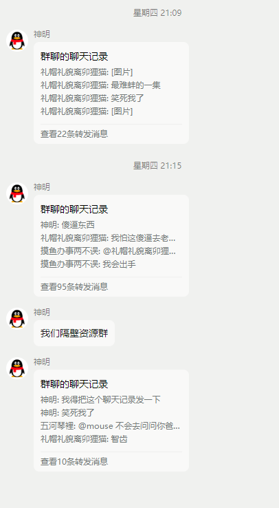
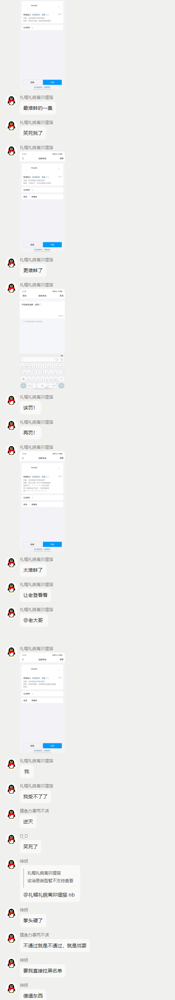
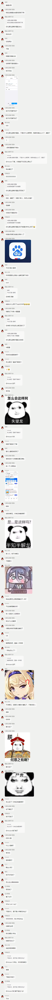
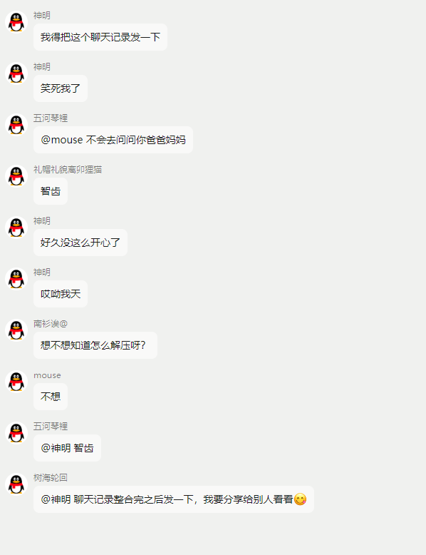
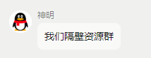
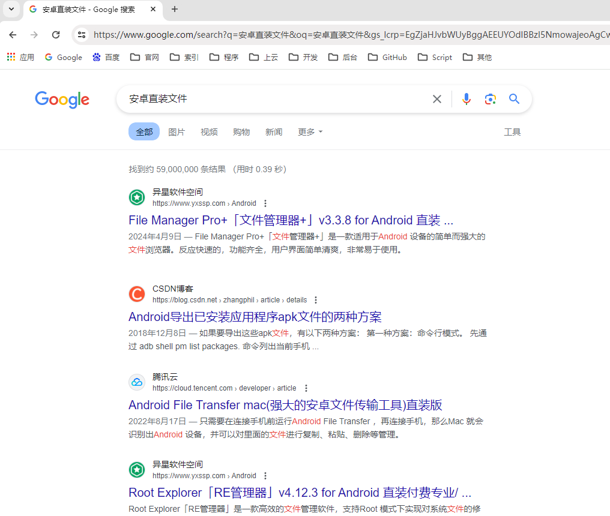

# 安卓直装文件

---

**Android包**（英语：Android Package，**APK**），是[Android](https://zh.wikipedia.org/wiki/Android)[操作系统](https://zh.wikipedia.org/wiki/操作系统)使用的一种[应用程序](https://zh.wikipedia.org/wiki/应用程序)包文件格式，用于分发和安装[移动应用](https://zh.wikipedia.org/wiki/移动应用)及[中间件](https://zh.wikipedia.org/wiki/中间件)。一个Android应用程序的代码想要在Android设备上运行，必须先进行[编译](https://zh.wikipedia.org/wiki/编译)，然后被打包成为一个被Android系统所能识别的文件才可以被运行，而这种能被Android系统识别并运行的[文件格式](https://zh.wikipedia.org/wiki/檔案格式)便是“APK”。 一个APK文件内包含被编译的代码文件(.dex 文件)，文件资源（resources）， assets，证书（certificates），和清单文件（manifest file）。[维基百科](https://zh.wikipedia.org/zh-cn/APK)

那么问题来了，聊天记录中的 “**安卓直装文件**” 是什么